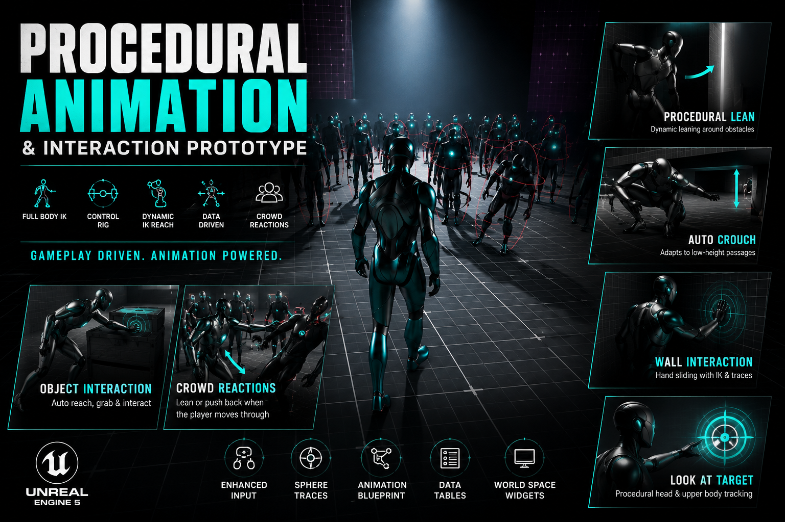
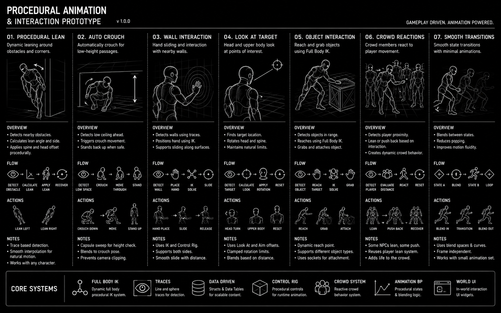

## 🎥 [Watch Procedural Animation & Interaction Prototype](https://youtu.be/DnQv0TTlzDI)

# Procedural Animation & Interaction Prototype

A technical Unreal Engine 5 prototype focused on procedural character animation, dynamic interaction systems, and responsive environmental behaviors. 

The project explores how gameplay-driven procedural systems can reduce reliance on traditional animation assets by generating character reactions in real-time through traces, IK, Control Rig, Full Body IK, and animation blending.

---

## Core Features

### 🏃‍♂️ Procedural Lean System
* **Dynamic Geometry Leaning:** Left and right leaning adapts dynamically based on surrounding geometry.
* **Environmental Adjustments:** Character automatically adjusts body posture when approaching obstacles and narrow spaces.
* **Zero Assets Required:** Achieved entirely through code/logic—no dedicated lean animations required.

### 🧱 Auto Crouch Traversal
* **Height Detection:** Automatically detects low-height obstacles and passages.
* **Automatic Adjustment:** Character seamlessly crouches when required to traverse tight spaces.
* **Gameplay-Driven:** Built fully using traces and environmental detection.

### 🖐️ Wall Interaction System
* **Procedural Hand Placement:** Natural hand placement and sliding against nearby walls.
* **Surface Alignment:** Uses IK and traces to position the hand realistically against surfaces.
* **Effortless Contact:** Eliminates the need for handcrafted wall-contact animations.

### 👀 Look At System
* **Dynamic Targeting:** Head and upper body dynamically rotate toward points of interest.
* **Object Awareness:** Supports advanced object awareness and interaction targeting.
* **Procedural Tracking:** Tracks targets smoothly without requiring animation authoring.

### 📦 Procedural Object Interaction
* **Trace-Based Detection:** Uses sphere-traces for precise object detection.
* **Full Body IK:** Dynamic Full Body IK reaching system that pulls the character's hand naturally toward the target object's interaction point.
* **UI Integration:** Supports interaction widgets and Data Table-driven item information.

### 💾 Data-Driven Pickup System
* **Structured Data:** Item information securely stored and managed using Structs and Data Tables.
* **Dynamic UI:** Populates World Space Widgets dynamically with:
  * Item Name
  * Item Type
  * Description
  * Value
* **Scalable Architecture:** A single interaction system supports multiple item types without requiring additional Blueprint logic.

### 👥 Crowd Interaction System
* **Reactive Crowds:** Nearby crowd characters react dynamically to player movement.
* **Shared Logic:** Characters procedurally lean and shift body posture when the player moves through dense groups, reusing the player's core procedural leaning system.
* **Physical Feedback:** Push-back reactions trigger upon physical contact, creating responsive, life-like crowd behavior.

### 🔄 Procedural Animation Blending
* **State Interpolation:** Multiple animation states blended through procedural interpolation.
* **Smoothing System:** Custom transition smoothing minimizes snapping between states.
* **Asset Efficiency:** Designed to achieve fluid, organic motion using a minimal set of base animation assets.

---

## Technologies Used

* **Engine:** Unreal Engine 5
* **Input:** Enhanced Input System
* **Rigging & IK:** Control Rig, Full Body IK
* **Animation:** Animation Blueprints, Procedural Animation Blending
* **Data Management:** Data Tables, Structs
* **Traces & Detection:** Sphere Traces, Environmental Traces
* **Architecture:** Actor Components, Blueprint Scripting
* **UI:** World Space Widgets

---

## Goal

The primary goal of this prototype is to investigate gameplay-driven procedural animation techniques that enhance responsiveness, reduce animation authoring requirements, and create more dynamic, systemic interactions between characters, objects, and crowds.
